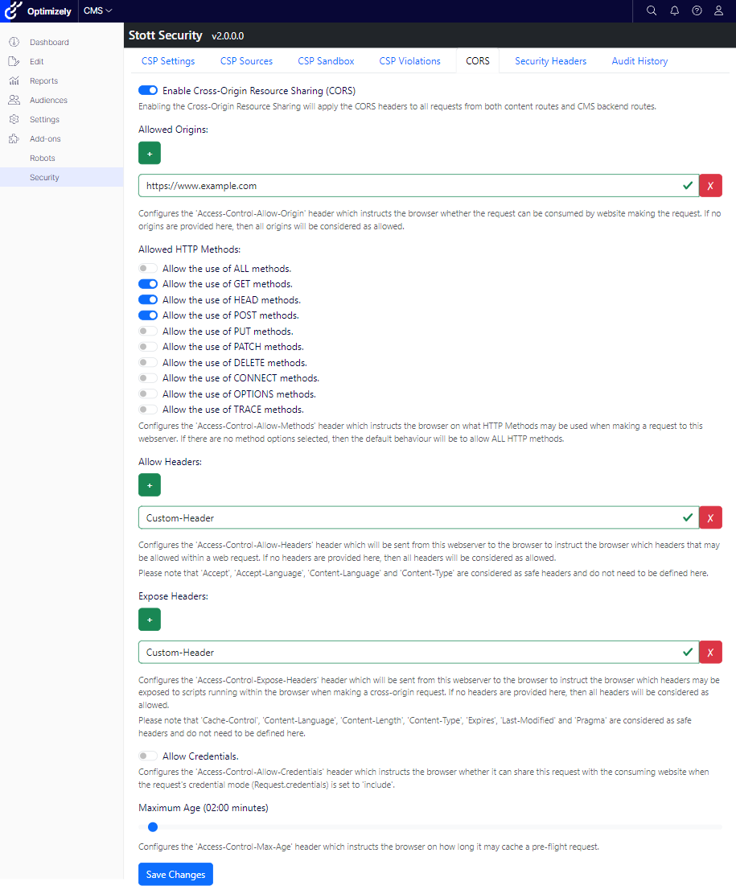

In December 2021, I started working on a new add-on for Optimizely CMS 12.  This add-on introduced a new way to manage the Content Security Policy within the CMS that was designed to be more accessible to non-technical people.  This Add-on allowed the CMS Administrator to define on an origin-by-origin basis what origin was allowed to do what action with the website with every change being fully audited. This Add-on is now live on a number of Optimizely CMS websites and has gone through a number of penetration tests.

I planned the next evolution of this Add-on to include the ability to manage Cross-origin Resource Sharing (CORS) headers from within the CMS administration interface.  CORS allows an API or Website to define what third parties can consume the resource as well as how they can consume the resource.  This can be an important security requirement if you are building a Headed or Hybrid CMS that exposes endpoints to be consumed by another website.

The intent for this update to the Stott Security add-on was to allow the CMS editor to set all of the following headers in an easy to manage interface:

- [Access-Control-Allow-Credentials](https://developer.mozilla.org/en-US/docs/Web/HTTP/Headers/Access-Control-Allow-Credentials)
- [Access-Control-Allow-Headers](https://developer.mozilla.org/en-US/docs/Web/HTTP/Headers/Access-Control-Allow-Headers)
- [Access-Control-Allow-Methods](https://developer.mozilla.org/en-US/docs/Web/HTTP/Headers/Access-Control-Allow-Methods)
- [Access-Control-Allow-Origin](https://developer.mozilla.org/en-US/docs/Web/HTTP/Headers/Access-Control-Allow-Origin)
- [Access-Control-Expose-Headers](https://developer.mozilla.org/en-US/docs/Web/HTTP/Headers/Access-Control-Expose-Headers)
- [Access-Control-Max-Age](https://developer.mozilla.org/en-US/docs/Web/HTTP/Headers/Access-Control-Max-Age)

I have introduced a new tab into the Stott Security Add-on named "CORS" that allows you to edit and save all of these headers together.



If the "Enable Cross-Origin Resource Sharing (CORS)" option is turned off, when a request is made to the website from third party, the response will be treated as if CORS is fully disallowed.  If the option is turned on, then the default behaviour is to allow all Origins;  It isn't until an entry is added to Allowed Origins that other origins will be denied access again.  The same behaviour applies for headers and HTTP methods, all are considered allowed until specific methods or headers are defined as being allowed.

There has been a distinct challenge in making the UI responsive and to reveal enough information to the user without overloading them with information.  There are plenty of online resources on websites such [MDN Web Docs](https://developer.mozilla.org/en-US/docs/Web/HTTP/Headers) that describe CORS and the various CORS headers that more detailed descriptions were deemed as too much for this UI.

## Implementing CORS

Once I had the UI for managing CORS and the tables sorted to store the configuration, I was able to start looking at how I could implement the behaviour.  At first, I attempted to build my own middleware to manage this, and it quickly dawned on me that this would be very complex to achieve.  The `Access-Control-Allow-Origin` header for example could only ever contain `*`, the origin of the site making the request or being absent entirely.  This prevents a website from revealing to third-parties who can consume them, only that the third-party website is allowed to consume them or not.

In an attempt to understand a better way of handling this, I added CORS to my sample website using the standard microsoft libraries by calling the `AddCors()` and `UseCors()` methods within my `startup.cs`.

By navigating to the decompiled version of `UseCors()` I was able to see the [CorsMiddleware](https://github.com/dotnet/aspnetcore/blob/main/src/Middleware/CORS/src/Infrastructure/CorsMiddleware.cs) that was implemented by microsoft and see that it used an implementation of `ICorsPolicyProvider` to retrieve a `CorsPolicy` object and an implementation of `ICorsService` to evaluate the [CorsPolicy](https://github.com/dotnet/aspnetcore/blob/main/src/Middleware/CORS/src/Infrastructure/CorsPolicy.cs) itself.  Looking at the decompiled code for `AddCors()` I could see that the dependency injection calls for `ICorsPolicyProvider` and `ICorsService` were using TryAdd which only adds the default implementations of these interfaces if they have not already been declared.

```
/// <summary>
/// Adds cross-origin resource sharing services to the specified <see cref="IServiceCollection" />.
/// </summary>
/// <param name="services">The <see cref="IServiceCollection" /> to add services to.</param>
/// <returns>The <see cref="IServiceCollection"/> so that additional calls can be chained.</returns>
public static IServiceCollection AddCors(this IServiceCollection services)
{
    if (services == null)
    {
        throw new ArgumentNullException(nameof(services));
    }

    services.AddOptions();

    services.TryAdd(ServiceDescriptor.Transient<ICorsService, CorsService>());
    services.TryAdd(ServiceDescriptor.Transient<ICorsPolicyProvider, DefaultCorsPolicyProvider>());

    return services;
}
```

Implementation then appeared to be relatively simple.  Create a custom Implementation of `ICorsPolicyProvider` that consumed the data saved by my Add-On to create an instance of [CorsPolicy](https://github.com/dotnet/aspnetcore/blob/main/src/Middleware/CORS/src/Infrastructure/CorsPolicy.cs) to be consumed by the default implementations of `ICorsService`.  The interface of `ICorsPolicyProvider` contained just a single method for me to implement.

```
/// <summary>
/// A type which can provide a <see cref="CorsPolicy"/> for a particular <see cref="HttpContext"/>.
/// </summary>
public interface ICorsPolicyProvider
{
    /// <summary>
    /// Gets a <see cref="CorsPolicy"/> from the given <paramref name="context"/>
    /// </summary>
    /// <param name="context">The <see cref="HttpContext"/> associated with this call.</param>
    /// <param name="policyName">An optional policy name to look for.</param>
    /// <returns>A <see cref="CorsPolicy"/></returns>
    Task<CorsPolicy?> GetPolicyAsync(HttpContext context, string? policyName);
}
```

To minimise performance issues, my data storage is a single table with a very flat record that is transformed into a domain object with multiple properties and collections.  To reduce further round trips to the SQL Server and constructing the domain object and then mapping that over to the [CorsPolicy](https://github.com/dotnet/aspnetcore/blob/main/src/Middleware/CORS/src/Infrastructure/CorsPolicy.cs) object, I also stored the compiled [CorsPolicy](https://github.com/dotnet/aspnetcore/blob/main/src/Middleware/CORS/src/Infrastructure/CorsPolicy.cs) object into Optimizely's `ISynchronizedObjectInstanceCache` which would then be invalidated on any subsequent update of the CORS policy.

```
public async Task<CorsPolicy?> GetPolicyAsync(HttpContext context, string? policyName)
{
    var policy = _cache.Get<CorsPolicy>(CacheKey);
    if (policy == null)
    {
        policy = await LoadPolicy();
        _cache.Add(CacheKey, policy);
    }

    return policy;
}
```

The end result is a fully functioning CMS editable CORS Policy that can be updated and can take effect immediately without requiring any code changes or deployments. To learn more about how CORS is implemented within .NET Core, you can read [A deep dive into the ASP.NET Core CORS library](https://andrewlock.net/a-deep-dive-in-to-the-asp-net-core-cors-library/) written by [Andrew Lock](https://andrewlock.net/about/) and view the open-source code for the [CorsMiddleware](https://github.com/dotnet/aspnetcore/blob/main/src/Middleware/CORS/src/Infrastructure/CorsMiddleware.cs) on GitHub.

## In Beta

I'm classing version 2.0.0 of this Add-on as being in beta until one or more CMS websites are live and consuming the CORS configuration and any raised issues are either prioritised or fixed.  If you'd like to use the 2.0.0 beta version, then do feel free to go ahead and install it into your Optimizely CMS 12 website and join the [discussion](https://github.com/GeekInTheNorth/Stott.Security.Optimizely/discussions/143) page on the [GitHub Repository](https://github.com/GeekInTheNorth/Stott.Security.Optimizely/discussions/143).
