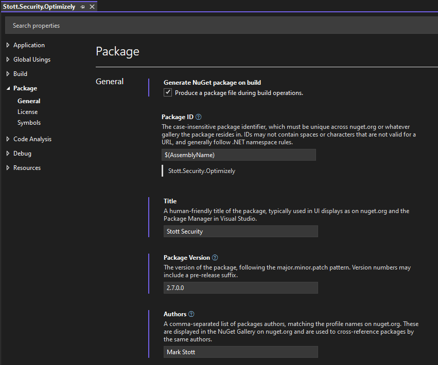

# Creating an Optimizely Addon - Packaging for NuGet

Published: 16th September 2024

In [Part One](/article/creating-an-optimizely-addon-part-1) and [Part Two](/article/creating-an-optimizely-addon-part-2) of this series; I covered topics from having a great idea, solution structure, extending the menus and adding gadgets to the editor interface.  In this part I will be covering the challenges of creating and submitting your AddOn as a NuGet package into the Optimizely NuGet feed.  You can view examples from across this series within the this [Optimizely AddOn Template](https://github.com/GeekInTheNorth/OptimizelyAddOnTemplate) that I have been creating.

## Defining What to Package

Each project within your solution must be created as a NuGet package if it is deemed to be the primary project or a dependency for the primary project. Consider the following solution as an example:

- MySolution.sln
  - MyAddOn.Admin.csproj
  - MyAddOn.Core.csproj
  - MyAddOn.Test.csproj

In this scenario, the administrator interface for the AddOn is separated from its core shared functionality. This design enables a consuming site to incorporate MyAddOn.Admin into their Optimizely website project and to reference MyAddOn.Core within any project in their solution structure. Consequently, MyAddOn.Admin has a direct dependency on MyAddOn.Core. To publish MyAddOn.Admin as a NuGet package, MyAddOn.Core must also be published as a NuGet package. It should be noted that MyAddOn.Admin only requires MyAddOn.Core as a project dependency during development; this dependency will be converted into a package dependency during the packaging process.

## Defining NuGet Properties

If you are using Visual Studio, right click on the project you want to package and select properties to show the project properties screen. Under the Package section you can define all of the properties for your NuGet package.



I would recommend you complete the following:

| Property | Reason |
|----------|--------|
| Package Id | This will need to be globally unique name within nuget.org and nuget.optimizely.com.  If you use the `$(AssemblyName)` variable, then this will match the name of the project. |
| Title | Visual Studio describes this as the name of the package used in UI displays such as Package Manager, but this largely does not get used. |
| Package Version | This should be a semantic version number with three or four parts and an optional alpha or beta tag. For Example:<br/>1.0.0<br/>1.0.0.0<br/>0.1.1-alpha<br/>0.2.2.0-beta |
| Authors | This should contain the names of all of the package owners. |
| Company | This should contain the name of the business that is behind creating the Addon.  If this is individually owned, then seting this to `$(Authors)` will mirror the value from the Authors property. |
| Description | This should be a short description about your Addon, this will be visible within the NuGet package feed and within the Plugin Manager screen within Optimizely CMS. |
| Copyright | This should contain the name of the owner and the year. You get copyright protection automatically when creating software and you do not have to apply or pay a fee.  There isn’t a register of copyright works in the UK.  There are however organisations which will provide extra protection for a fee for validating your copyright.  You can read more about copyright here: [How copyright protects your work](https://www.gov.uk/copyright). It is however worth you performing your own research into the matter within the country you live in. |
| Project Url | This should point either to the repository for your Addon or an appropriate project page.  Developers will use this to find out more about your Addon or to report issues that may need resolving. |
| Readme | I have set this to the readme.md for my repositories, this will be visible to developers within the NuGet platform. |
| Repository Url | This should point to the repository for your Addon, assuming that your Addon is Open Source. |
| Tags | This is a delimited set of tags that make your package easier to find within the NuGet feeds. |
| License File | This should reference the license within your repository. Careful consideration should be given to the type of license for your AddOn. Certain licenses may require your users to make their code open source to utilize your package, so think carefully about the permissiveness or restrictiveness of your license. It is noteworthy that some highly popular AddOns employ an MIT or Apache license.<br/><br/>I am utilizing an MIT license due to its permissive nature and lack of warranty. While I do engage with my users and address any issues that are raised, my AddOns are free and are maintained in my free time. |
| Require License Acceptance | If you tick this, the consumer will have to accept the license as they install the package. If you are using an MIT license, you may want to tick this to encourage the consumer to accept the warranty free nature of your AddOn. |

If you are using Visual Studio Code instead of Visual Studio, then you can edit the .csproj directly and add the package properties directly as XML values at the top of the csproj file. You can also add these properties into a .nuspec instead, when you package your project, the values from the .csproj and .nuspec are merged into a new .nuspec that is contained in the root of the compiled .nupkg file. I personnally prefer to put the NuGet properties directly into the .csproj.

```
<Project Sdk="Microsoft.NET.Sdk.Razor">
  <PropertyGroup>
    <TargetFrameworks>net6.0;net8.0</TargetFrameworks>
    <AddRazorSupportForMvc>true</AddRazorSupportForMvc>
    <Version>1.1.0.0</Version>
    <RepositoryUrl>https://example.com/</RepositoryUrl>
    <PackageProjectUrl>https://example.com/</PackageProjectUrl>
    <PackageLicenseFile>LICENSE.txt</PackageLicenseFile>
    <Authors>Your Name</Authors>
    <Description>Your Package Summary</Description>
    <Copyright>Your Name 2024</Copyright>
    <PackageTags>TagOne TagTwo</PackageTags>
    <PackageRequireLicenseAcceptance>true</PackageRequireLicenseAcceptance>
    <RepositoryType>git</RepositoryType>
    <PackageReadmeFile>README.md</PackageReadmeFile>
    <AssemblyVersion>1.1.0.0</AssemblyVersion>
    <GeneratePackageOnBuild>True</GeneratePackageOnBuild>
    <PackageReleaseNotes>A short release summary.</PackageReleaseNotes>
    <Nullable>enable</Nullable>
    <Title>Package Name</Title>
  </PropertyGroup>
```

## NuGet Package Structure

A NuGet Package is simply a zip file containing a structured set of files. If you rename a .nupkg to a .zip, you can extract it and explore it's structure. This will have a structure similar to the following:

- package
  - services
    - metadata
      - core-properties
- build
  - project.name.targets
- contentFiles
  - additional.file.txt
- lib
  - net6.0
    - my.project.dll
  - net8.0
    - my.project.dll
  - my.project.nuspec
- _rels
- [Content_Types].xml
- readme.md
- license.txt

Folders such as build, contentFiles and the target folders under lib will vary depending on your code and deployable files. The readme.md and license.txt files referenced in your .csproj or .nuspec are copied to the root of the NuGet package.

## Packaging for Multiple Frameworks

.NET Core is backwards compatible, meaning that if you build your package for .NET 6, it can be installed into .NET 6, 7, and 8. For most AddOns, compiling directly for .NET 6 ensures maximum compatibility.

However, there may be instances where you need to compile your application in multiple framework versions. For example, if you are using Entity Framework and Migrations, there is a breaking change between .NET 6 and .NET 8. Fortunately, no code changes are required, but you will need to set your dependencies separately for .NET 6 and .NET 8. To accomplish this, you must make two modifications.

1. Change the `TargetFramework` node in your .csproj to be `TargetFrameworks` and separate your target frameworks with a semicolon. e.g. `net6.0;net8.0`.
2. Add a separate `ItemGroup` per framework version to contain framework specific dependencies and add a condition to the ItemGroup to target the specific framework. e.g. `Condition="'$(TargetFramework)' == 'net6.0'"`. 

```
<Project Sdk="Microsoft.NET.Sdk.Razor">
  <PropertyGroup>
    <TargetFrameworks>net6.0;net8.0</TargetFrameworks>
    <AddRazorSupportForMvc>true</AddRazorSupportForMvc>
    <Nullable>enable</Nullable>
  </PropertyGroup>

  <ItemGroup Condition="'$(TargetFramework)' == 'net6.0'">
    <PackageReference Include="Microsoft.EntityFrameworkCore.SqlServer" Version="6.0.6" />
  </ItemGroup>

  <ItemGroup Condition="'$(TargetFramework)' == 'net8.0'">
    <PackageReference Include="Microsoft.EntityFrameworkCore.SqlServer" Version="8.0.1" />
  </ItemGroup>
```

This will double the size of your NuGet package as it will contain separate folders for each target framework containing your code compiled for that framework.

## Packaging Additional Files For The Protected Modules Folder

If your package contains an `IFrameComponent` or other files needed to extend the Editor Interface. A `module.config` file and those files will need to be deployed to the `modules/_protected/my.project` folder within the target website.

First you will need to tell the .csproj file that we want to copy these files into the `contentFiles` folder of the NuGet package.  This is as simple as setting the build output for those files to be `None` and to set the `PackagePath` to be inside of the `contentFiles` folder.

```
<ItemGroup>
  <None Include="module.config">
    <Pack>true</Pack>
    <PackagePath>contentFiles\module.config</PackagePath>
  </None>
</ItemGroup>
```

You will then need to create a .targets file that instructs the NuGet package installer how to handle those files. The example below is taken straight from my own Addons where I am doing the same thing.

The `ItemGroup` tells the .targets file where the specific files are within the NuGet package structure.  The `$(MSBuildThisFileDirectory)` variable in this case is a reference to the directory the .targets file sits in.  As this is in a build folder, I have used the `$(MSBuildThisFileDirectory)` variable in combination with the relative path to my `module.config` file.

The `Target` node is then performing an action that is configured to execute on `BeforeBuild`.  This then performs a `Copy` action that will take my `module.config` file from the `contentFiles` folder in the nuget package to the `modules\_protected\Stott.Security.Optimizely` folder within the target website.  This means that when you first install the package, the module.config file and folder will not exist within the protected modules folder.  When you first build the solution they will be copied into this location.

```
<?xml version="1.0" encoding="utf-8"?>
<Project xmlns="http://schemas.microsoft.com/developer/msbuild/2003" ToolsVersion="4.0">
  <ItemGroup>
    <MyFiles Include="$(MSBuildThisFileDirectory)..\contentFiles\module.config" />
  </ItemGroup>
  
  <Target Name="CopyFiles" BeforeTargets="BeforeBuild">
        <Copy SourceFiles="@(MyFiles)" DestinationFolder="$(MSBuildProjectDirectory)\modules\_protected\Stott.Security.Optimizely\" />
    </Target>
</Project>
```

In order to make sure the `.targets` file can be executed, we also need to make sure that it is copied into the NuGet package file. This is as simple as setting the build output for the `.targets` file to be `None` and to set the `PackagePath` to be inside of the `build` folder.

```
<ItemGroup>
  <None Include="msbuild\copyfiles.targets">
    <Pack>true</Pack>
    <PackagePath>build\$(MSBuildProjectName).targets</PackagePath>
  </None>
</ItemGroup>
```

## Submitting Your Package

Before submitting your AddOn to the Optimizely NuGet package feed, it is essential to ensure that your package installs successfully both in your local environment and within a CI/CD pipeline. To expedite this process, consider publishing your package as an alpha or beta build to [nuget.org](https://www.nuget.org) first. After publishing, your package will be indexed and available for retrieval within a few minutes.

To designate your package as an alpha or beta release, you should modify the `version` property within your `.csproj` file to include a trailing `-alpha` or `-beta`. NuGet will automatically recognize this as a pre-release version and will generally filter these versions out by default. Developers can view these pre-release versions by selecting the option to display pre-release versions within their IDE’s NuGet package tool.

```
<Version>2.0.0.2-beta</Version>
```

Upon publishing the alpha or beta version of your package to [nuget.org](https://www.nuget.org) and confirming its successful installation both locally and in a CI/CD pipeline, you will be prepared to submit the live version of your package to Optimizely.

Ensure that you have an [Optimizely World](https://world.optimizely.com) account. You can create a new account by visiting [Optimizely World](https://world.optimizely.com) and following the registration link located in the top right corner. This account will also provide access to the Optimizely NuGet feeds. Optimizely maintains two NuGet feeds:

- https://nuget.optimizely.com (v2 NuGet feed)
- https://api.nuget.optimizely.com (v3 NuGet feed)

Packages uploaded to the v2 NuGet feed are automatically synchronized to the v3 NuGet feed. Therefore, it is advisable to upload your packages to the v2 NuGet feed. Once Optimizely receives your package, it will undergo an approval process conducted by Optimizely's QA team. During this process, the QA team will verify that your AddOn functions correctly with the CMS. Including test guidance in the readme for your repository can be very beneficial for the QA team. This review process may take one or more business days, and there is currently no feedback mechanism to inform you of the status or outcome of the testing. You may periodically check the NuGet feed to determine if your package has been accepted. Given that Optimizely validates all packages uploaded to their NuGet feed, it is recommended to download AddOn updates directly from Optimizely and distribute your own package in this manner. Should you need to release a hotfix promptly, you may consider uploading it to nuget.org.

It is advisable to upload your package to nuget.org at least once in addition to the Optimizely NuGet feed. This ensures that the package name is reserved on nuget.org, avoiding potential conflicts in package names across the main feeds that could affect your consumers.

_Please note that as of the time of writing, there was an issue with packages uploaded directly to the v3 NuGet feed not being synchronized back to the v2 NuGet feed. Until this issue is resolved, the Upload link on the v3 NuGet feed redirects users to the v2 NuGet feed. Optimizely is actively working to resolve this issue._

## Summary

- Build your package for .NET 6 for maximum compatability
  - Build your package for both .NET 6 & 8 if you have compatability issues between both frameworks.
- Use a Razor Class Library so you can package your UI and C# code together.
- Think very carefully about which license you will use for your package.
- Use a build targets file to put files into specific folders within a consuming application.
- Test your package installs and works as an alpha/beta on nuget.org before submitting to the Optimizely NuGet feed.
- Upload your package to [nuget.optimizely.com](https://nuget.optimizely.com) when it is ready.
