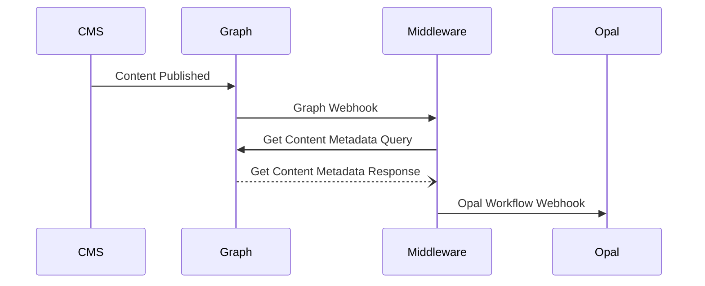

Over the course of November, my colleagues at Netcel and I took part in Optimizely's Opal Innovation Challenge.  We were tasked to be inventive and to discover new ways in which we could use Opal with emphasis on Specialized Agents, Workflows and Tools.  If you are unaware of what these features are, my colleague [Graham Carr](https://www.linkedin.com/in/carrgraham/) has written a great introduction blog entitled [A day in the life of an Optimizely OMVP - Optimizely Opal: Specialized Agents, Workflows, and Tools Explained](https://world.optimizely.com/blogs/allthingsopti/dates/2025/12/a-day-in-the-life-of-an-optimizely-omvp---optimizely-opal-specialized-agents-workflows-and-tools-explained/).

In this technical blog, I'm going to focus on how we can leverage publish events to trigger workflows within Opal.  The traditional method of doing this would be to leverage content events in **C#** by registering handlers for the **IContentEvents** interface.  This approach has the downside of only being applicable for **PaaS** solutions.  In this blog I will be showing you how to achieve the same goal using webhooks in **Content Graph** which has the advantage of being applicable to both **SaaS** and **PaaS** CMS.

>💡**Tip:** Optimizely is moving away from **Search & Navigation** to **Content Graph** for improved flexibility, stability and performance. Use add-ons such as [OptiGraphExtensions](https://world.optimizely.com/blogs/allthingsopti/dates/2025/12/a-day-in-the-life-of-an-optimizely-omvp---optigraphextensions-v2.0-enhanced-search-control-with-language-support-synonym-slots-and-stop-words) to manage your synonyms in **Content Graph**.

## Proposed Flow



## Creating the Workflow in Opal


## Creating Webhooks In Content Graph

Testing Webhook responses can be a challenge, especially if you are unsure what real data is going to look like.  This is where tools such as [**WebHook**Cool](https://webhook.cool/) come in.  This particular website provides you with a temporary end point that you can point your webhook so that you can examine your data before implementing an endpoint.  

> 🔒 **Security Warning:** Third party tools like WebHookCool can be useful for testing APIs, however you should **never** use them with a production environment or anything that might contain PII data.

We are going to start off by registering our WebHookCool endpoint as a webhook in Content Graph with a simple POST request.  Here I've set the topic to be "doc.updated" which tells Content Graph we are only interested in single document update events.  We are also going to set our filters so that we are only interested in published content items:

```JSON
POST https://cg.optimizely.com/api/webhooks
Content-Type: application/json
Authorization: Basic <Base64 encoded App Key and Secret>

{
    "request" : {
        "url" : "https://webhook.cool/at/randomly-generated-name",
        "method": "post"
    },
    "topic": ["doc.updated"], 
    "filters": [
        {
            "status": { "eq": "Published" }
        }
    ]
}
```

When you update the content item in Content Graph you will get one or more webhook events being executed with a response like so:

```JSON
{
  "timestamp": "2025-12-22T13:56:00.7410789+00:00",
  "tenantId": "00000000000000000000000000000000",
  "type": {
    "subject": "doc",
    "action": "updated"
  },
  "data": {
    "docId": "662e2c97-c658-497d-a998-1c00df22e600_en_Published"
  }
}
```

Out of the box this isn't terribly helpful for Opal as this doesn't contain any information about the updated page beyond the docId which is a unique identifier within graph for the content item.  If you wanted to pass something more useful to Opal, like a URL, then you will need a middleman end point to handle this.

> 🔒 **Please Note:** identifiers in these examples have been swapped out with a randomly generated id to aid visualization and should not reflect any specific system.

The first thing we will need is to convert the Content Graph docId into data we can use to filter graph queries.  This requires us to split the docId based on underscores with the first component being the Content GUID, the second being the language for the content and the third being the published state.  To make matters more interesting, the Content GUIDs are stored without hyphens in Content Graph, so we have to strip those out too:

```C#
public bool TryConvertContentIdentifiers(string docId, out string id, out string locale)
{
    id = string.Empty;
    locale = string.Empty;
    if (string.IsNullOrWhiteSpace(docId))
    {
        return false;
    }

    var components = docId.Split('_');
    if (components.Length < 2 || !Guid.TryParse(components[0], out _) || string.IsNullOrWhiteSpace(components[1]))
    {
        return false;
    }

    id = components[0].Replace("-", string.Empty);
    locale = components[1];
    return true;
}
```

This will essentially turn `662e2c97-c658-497d-a998-1c00df22e600_en_Published` into `662e2c97c658497da9981c00df22e600` and `en`.  We can then use these to request URL data from Content Graph with our query looking like:

```graphql
query MyQuery {
  _Page(
    orderBy: { _modified: DESC }
    where: {
      _metadata: { key: { eq: "662e2c97c658497da9981c00df22e600" }, locale: { eq: "en" } }
    }
  ) {
    items {
      _id
      _metadata {
        url {
          base
          hierarchical
          default
        }
      }
    }
  }
}
```

This will have a response that looks like:

```JSON
{
  "data": {
    "_Page": {
      "items": [
        {
          "_id": "662e2c97-c658-497d-a998-1c00df22e600_en_Published",
          "_metadata": {
            "url": {
              "base": "https://www.example.com",
              "hierarchical": "/insights/",
              "default": "/insights/"
            }
          }
        }
      ]
    }
  },
  "extensions": { ... }
}
```

We can then wrap this up into a request to get the data from Content Graph by performing the following:

- Using a StringBuilder to create the query.
- Retrieving the data from Content Graph using single key authentication.
- Serializing the data onto an object model based on the example response above.
- Validating the URL data for each content item in the response

```C#
public async Task<List<Uri>> GetContentUris(string id, string locale)
{
    if (string.IsNullOrWhiteSpace(id) || string.IsNullOrWhiteSpace(locale))
    {
        return [];
    }

    // Build GraphQL Query to fetch content details
    var stringBuilder = new StringBuilder();
    stringBuilder.AppendLine("query MyQuery {");
    stringBuilder.AppendLine("  _Page(");
    stringBuilder.AppendLine("    orderBy: { _modified: DESC }");
    stringBuilder.AppendLine("    where: {");
    stringBuilder.AppendLine($"      _metadata: {{ key: {{ eq: \"{id}\" }}, locale: {{ eq: \"{locale}\" }} }}");
    stringBuilder.AppendLine("    }");
    stringBuilder.AppendLine("  ) {");
    stringBuilder.AppendLine("    items {");
    stringBuilder.AppendLine("      _id");
    stringBuilder.AppendLine("      _metadata {");
    stringBuilder.AppendLine("        types");
    stringBuilder.AppendLine("        key");
    stringBuilder.AppendLine("        locale");
    stringBuilder.AppendLine("        published");
    stringBuilder.AppendLine("        url {");
    stringBuilder.AppendLine("          base");
    stringBuilder.AppendLine("          hierarchical");
    stringBuilder.AppendLine("          default");
    stringBuilder.AppendLine("        }");
    stringBuilder.AppendLine("      }");
    stringBuilder.AppendLine("    }");
    stringBuilder.AppendLine("  }");
    stringBuilder.AppendLine("}");

    // Get the data from Content Graph using a GET request using single key authentication
    var query = stringBuilder.ToString();
    var authKey = configuration.GetValue<string>("GraphSingleKey");
    var graphUri = new Uri($"https://cg.optimizely.com/content/v2?auth={authKey}&cg-roles=Content%20Editors&query={Uri.EscapeDataString(query)}");

    var httpClient = httpClientFactory.CreateClient();
    var response = await httpClient.GetAsync(graphUri);

    response.EnsureSuccessStatusCode();

    var content = await response.Content.ReadAsStringAsync();
    var contentResponse = JsonSerializer.Deserialize<ContentQueryResponseDto>(content)!;

    // Validate the results so we only return URLs that are valid absolute URLs.
    var pages = contentResponse?.Data?.Pages?.Items ?? [];
    var contentUris = new List<Uri>();
    foreach (var page in pages)
    {
        var contentUrl = $"{page.Metadata?.Url?.Base}{page.Metadata?.Url?.Hierarchical}";
        if (Uri.IsWellFormedUriString(contentUrl, UriKind.Absolute))
        {
            contentUris.Add(new Uri(contentUrl));
        }
    }

    return contentUris;
}
```

Now we have a means to transform the data from the Graph Webhook and to retrieve the URL data from Content Graph, we can use this inside of a C# Controller to do the following:

- Act as the endpoint for the Content Graph Webhook
- Retrieve the URLs for the updated content items from Content Graph
- Push each URL into the Opal Workflow Webhook

```C#
[HttpPost]
[Route("api/content/publish")]
[Consumes("text/plain", "application/json")]
public async Task<IActionResult> ContentPublishEvent([FromQuery] string apiKey)
{
    // [FromBody] attribute does not work with a content-type of text/plain.
    // So read the response body out manually and then deserialize it.
    WebhookEventDto? contentPublishEvent;
    using (var reader = new StreamReader(Request.Body, Encoding.UTF8))
    {
        var body = await reader.ReadToEndAsync();
        if (string.IsNullOrWhiteSpace(body))
        {
            return BadRequest();
        }

        contentPublishEvent = JsonSerializer.Deserialize<WebhookEventDto>(body);
    }

    // Validate the request payload has the required data items
    if (string.IsNullOrWhiteSpace(contentPublishEvent?.Data?.DocId) || string.IsNullOrWhiteSpace(apiKey))
    {
        return BadRequest();
    }

    // Convert Identifiers from the Content Graph Webhook data into values to locate the item in Content Graph
    if (!TryConvertContentIdentifiers(contentPublishEvent.Data.DocId, out var id, out var locale))
    {
        return BadRequest();
    }

    // Get Page Uris from Content Graph
    var pageUris = await GetContentUris(id, locale);

    // Send Page Uri's to the Opal Workflow Webhook
    foreach (var pageUri in pageUris)
    {
        await PostAsync(opalUri, new { url = pageUri.ToString() });
    }

    return Ok();
}

public async Task PostAsync<TRequest>(string url, TRequest requestBody)
{
    var httpClient = httpClientFactory.CreateClient();
    var jsonContent = new StringContent(JsonSerializer.Serialize(requestBody), Encoding.UTF8, "application/json");
    var response = await httpClient.PostAsync(url, jsonContent);
    
    response.EnsureSuccessStatusCode();
}
```

2025-12-22-triggering-opal-workflows-on-publish.md


## References

- [Optimizely Developer Documentation - Content Graph - Manage Webhooks](https://docs.developers.optimizely.com/platform-optimizely/docs/manage-webhooks)
- [WebhookCool](https://webhook.cool/)